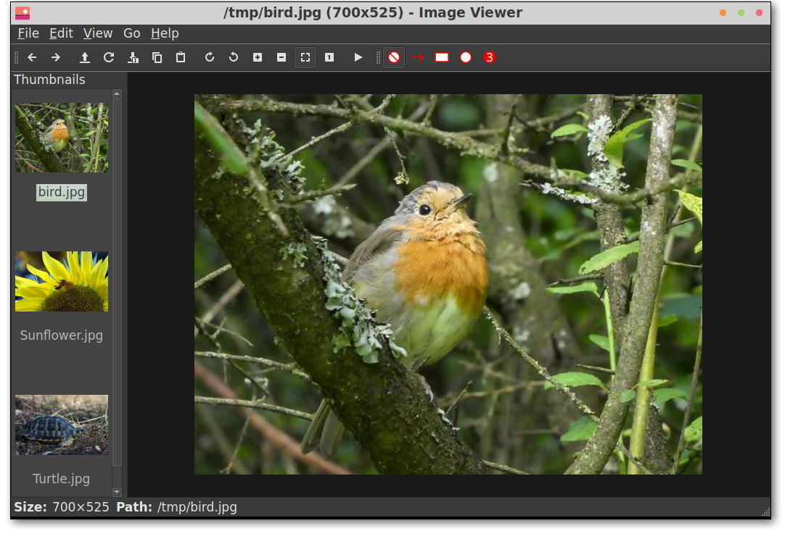

# LXImage-Qt

## Overview

LXImage-Qt is the Qt port of LXImage, a simple and fast image viewer.

## Features

* Zoom, rotate, flip and resize images
* Slideshow
* Thumbnail bar (left, top or bottom); different thumbnail sizes
* Exif data bar
* Inline image renaming
* Custom shortcuts
* Image annotations (arrow, rectangle, circle, numbers)
* Recent files
* Upload images (Imgur)
* Take screenshots

More features can be found when it is used. LXImage-Qt is maintained by the LXQt project
but can be used independently from this desktop environment.

**NOTE:** LXImage-Qt can handle all image formats supported by Qt. `qt5-imageformats` and
[`kimageformats`](https://api.kde.org/frameworks/kimageformats/html/index.html) extend
the range of supported formats considerably and without extra dependencies. Their
installation is recommended.

## Installation

### Compiling source code

Runtime dependencies are qtx11extras and [libfm-qt](https://github.com/lxqt/libfm-qt).
Additional build dependencies are CMake, [lxqt-build-tools](https://github.com/lxqt/lxqt-build-tools)
and optionally Git to pull latest VCS checkouts.

Code configuration is handled by CMake. CMake variable `CMAKE_INSTALL_PREFIX`
has to be set to `/usr` on most operating systems.

To build run `make`, to install `make install` which accepts variable `DESTDIR`
as usual.

### Binary packages

Official binary packages are available in all major distributions. Just use the distributions'
package manager to search for string 'lximage-qt'.

### Translation

Translations can be done in [LXQt-Weblate](https://translate.lxqt-project.org/projects/lxqt-desktop/lximage-qt/).

